# HelloWorldJSP

Please check out the java files in the `src` folder and the .jsp files in the `WebContent` folder. Everything else was auto-generated and can be ignored for now.

# Downloads

1. Download and install JDK 1.8 (if needed) http://www.oracle.com/technetwork/java/javase/downloads/jdk8-downloads-2133151.html

2. Download eclipse and unpack the archive wherever you like  http://www.eclipse.org/downloads/download.php?file=/technology/epp/downloads/release/neon/1a/eclipse-java-neon-1a-win32-x86_64.zip

3. Download this zip (Tomcat server) file and unzip it into your documents folder http://mirrors.advancedhosters.com/apache/tomcat/tomcat-6/v6.0.45/bin/apache-tomcat-6.0.45-windows-x64.zip

# Configure Eclipse

Open eclipse. Go to Help > Install new software...

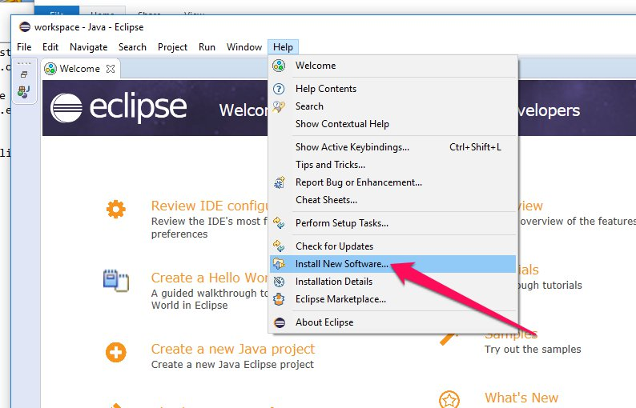

Click (Add...)

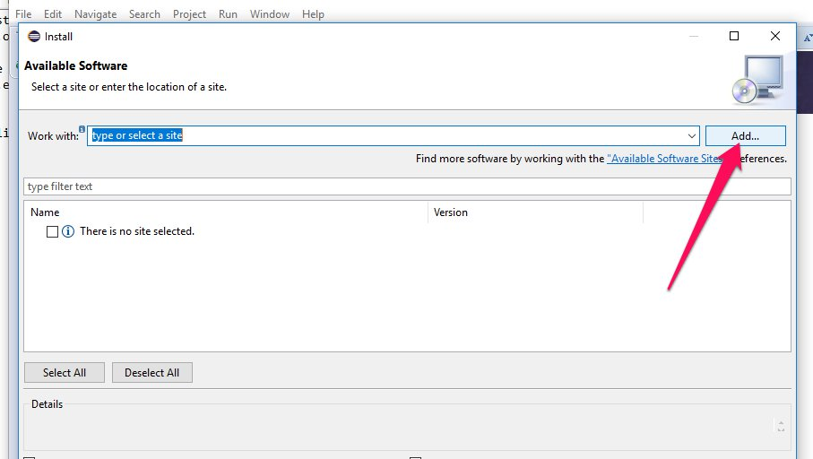

Enter the following URL: http://download.eclipse.org/webtools/updates/

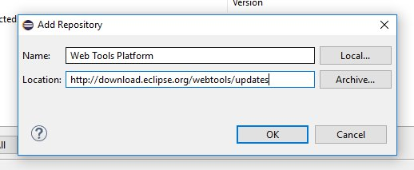

Select these check boxes **(Also check "Project Provided Components")**

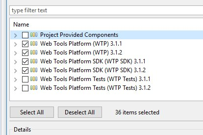

Follow the instructions to install.

Go to Help > Install new software.  
Choose Work with: "Neon - http..." (may also be Luna, Mars, or Kepler depending on your version).  
Install *Eclipse Java EE Developer Tools*, *Eclipse Java Web Developer Tools*, *JST Server Adapters*, and *Eclipse Web Developer Tools*.

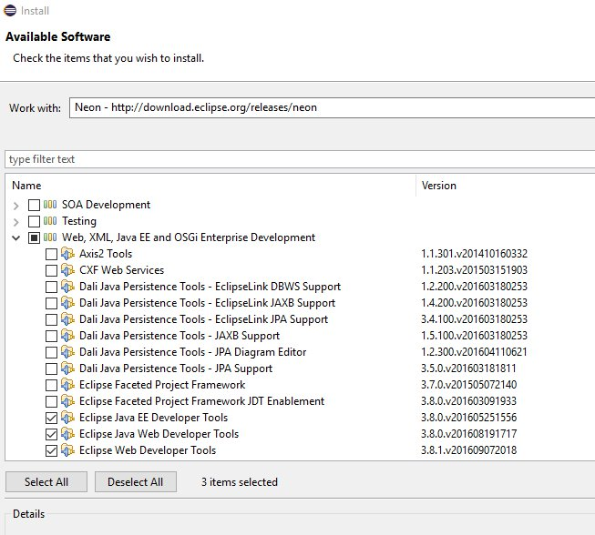

After eclipse restarts, go to Window > Perspective > Open Perspective > Other...
Choose Java EE

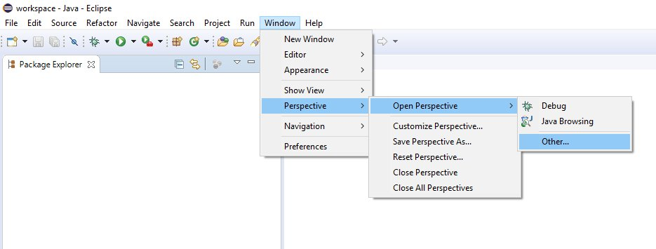

Go to File > Import ...
Select Git > Projects from git. Click Next
Select "Clone URI"

Paste "https://github.com/nick-paul/HelloWorldJSP" into the URI field
Host and Reop path should populate automatically
Enter yout github username and password in the Authentication box

select the master branch, click next, next, finish (use defaults)

Add a new server

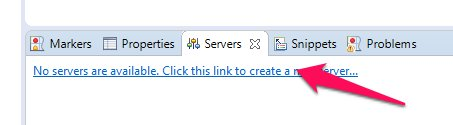

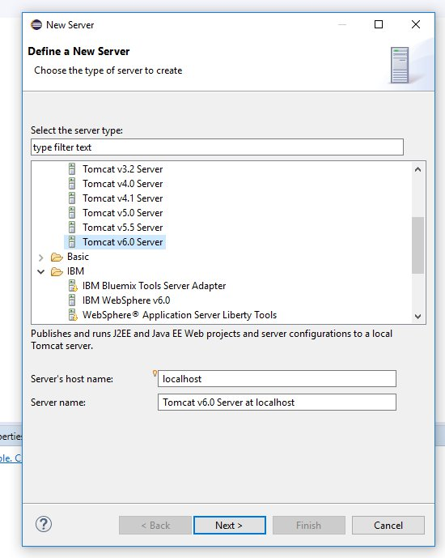

Click Browse... and select the Tomcat folder from step 3

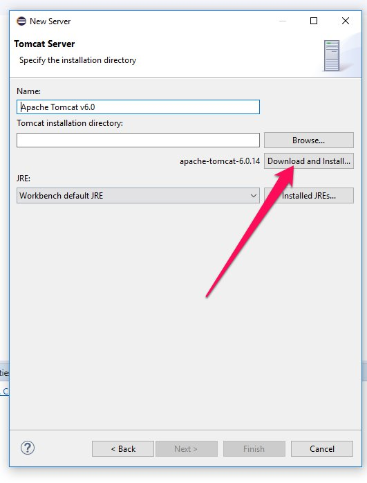

Attach HelloWorldJSP to the server

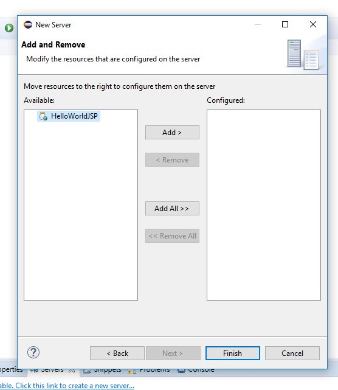

Start the server

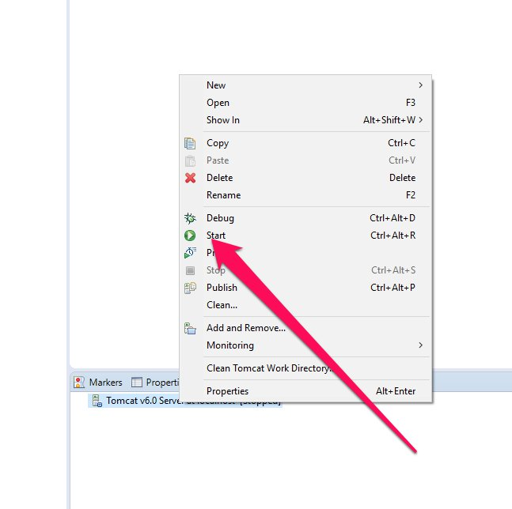

Navigate to http://localhost:8080/HelloWorldJSP/basicServlet

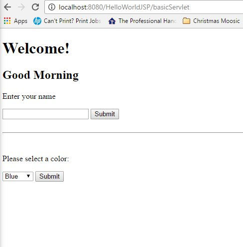

Any time you make a change, the server should synchronize automatically. If your changes do not show up. Just restart the server (same button as starting the server).
